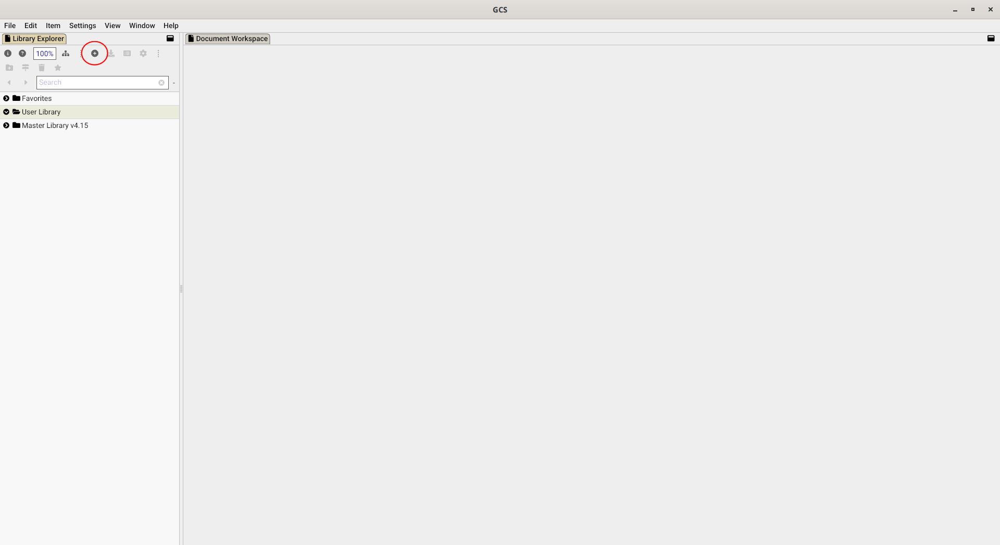
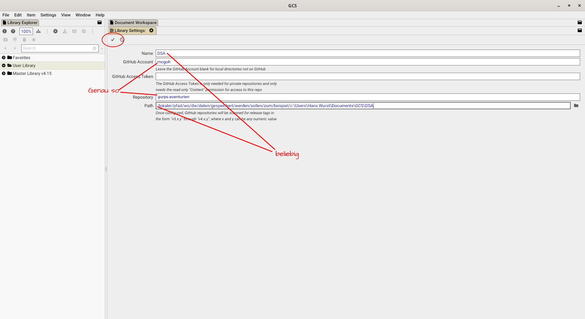
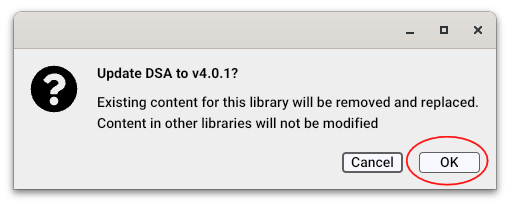
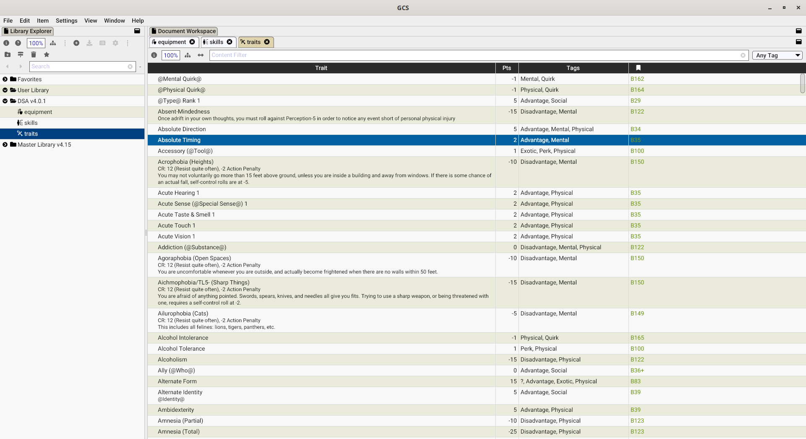

# GURPS-Aventurien

In der Welt von Aventurien mit GURPS-Regel spielen.

## Regeln

Die Regeln befinden sich unter [Library/regeln/...](Library/regeln/charaktererschaffung.md)

## GURPS Character Sheet

Um die Regeln in GURPS Character Sheet (GCS) nutzen zu können bitte diesen Anweisungen folgen:

1. Add Library (mit dem Plus-Symbol).

2. Library-Details ausfüllen.

- Name: `gurps-aventurien` (beliebig)
- GitHub Account: `mogoh`
- GitHub Access Token: (leer lassen)
- Repository: `gurps-aventurien`
- Path: `C:\User\Hans Wurst\Documents\GCS\DSA` (beliebig, je nach dem wo alles gespeichert werden soll)

Alles mit dem Häkchen bestätigen.

3. Hinzufügen bestätigen

4. Tada!

